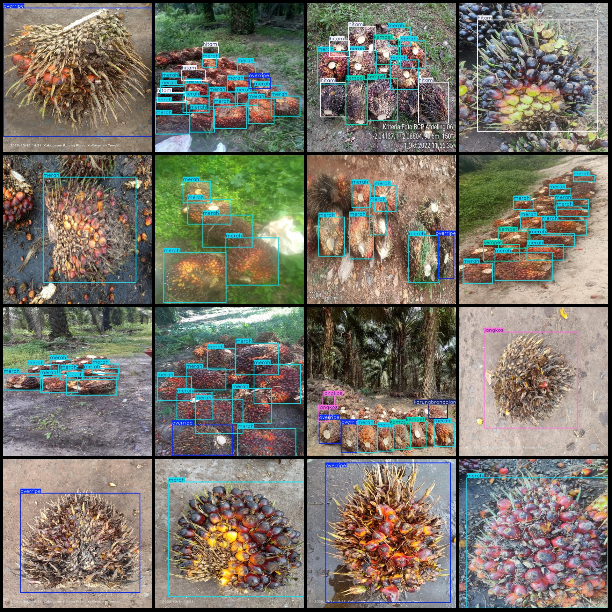
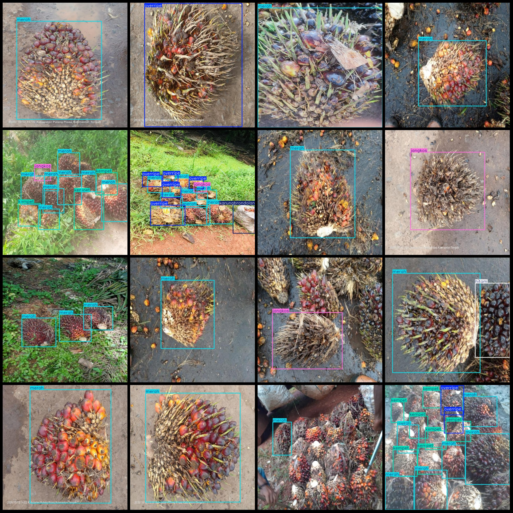

# Oil palm fruit defect detection dataset VOC+YOLO format: 1901 images in 8 categories

Dataset format: Pascal VOC format + YOLO format (txt file without segmentation path, only containing jpeg images and corresponding VOC format xml files and YOLO format txt files)
Number of images (jpg file count): 1901
Number of annotations (xml file count): 1901
Number of annotations (txt file count): 1901
Number of annotation categories: 8
Annotation category names (note that the order of categories in the YOLO format does not correspond to this, and should be based on the labels folder's classes.txt): ["busuk", "hitam", "jangkos", 
"karungbrondolan", "kempet", "merah", "overripe", "partenokarpi"]
Each category annotation number of boxes:  
busuk (rotten) box count = 98  
hitam (black) box count = 183  
jangkos (withered/dry) box count = 260  
karungbrondolan (landing fruits in sacks) box count = 110  
kempet (depression) box count = 2760  
merah (red) box count = 6954  
overripe (over-ripe) box count = 1671  
partenokarpi (monocarpic fruit) box count = 87  
Total box count: 12123  
Image resolution: 608x608  
Annotation tool used: labelImg  
Annotation rules: draw a square around the category  
Important note: No special statement is currently made regarding this dataset.
Special declaration: This dataset does not guarantee any accuracy of trained models or weight files.
Image preview:

## Images

Here is a pay link on Stripe ( https://buy.stripe.com/3cs8yP7sY87d0vu9AB ). Please contact me lonlonago@foxmail.com after funding $89, and I will send you a complete data files , thank you!

